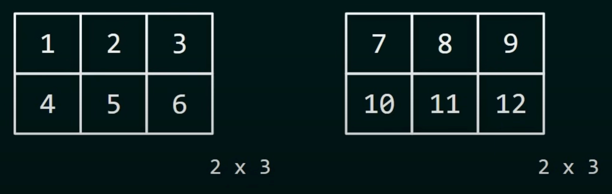
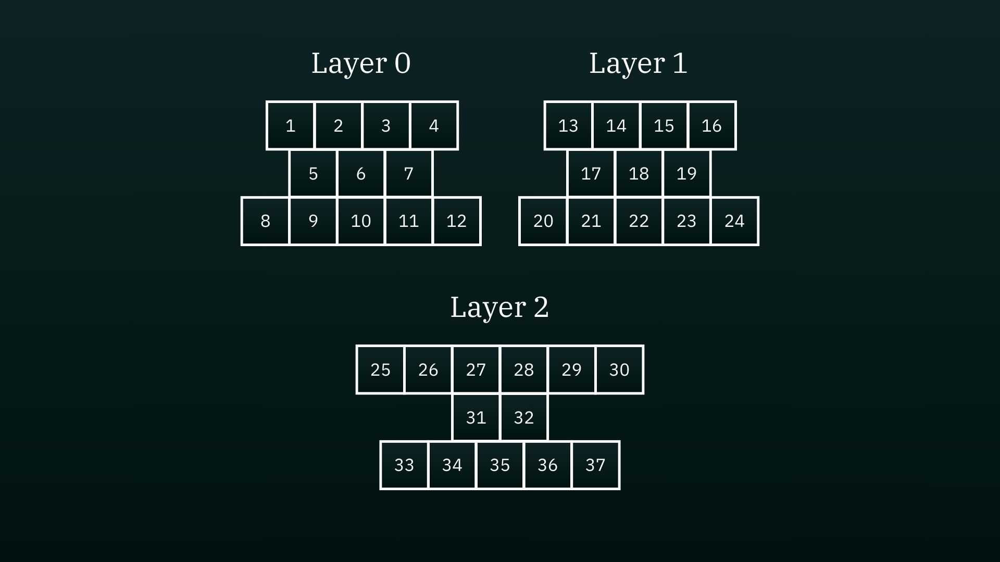

# 3 Dimensional Arrays

### Simple Demonstration of 3D Array

The following demonstrates two layers of a three dimensional array. 
- Layer 0 consists of elements {{1,2,3},{4,5,6}}
- Layer 1 consists of elements {{7,8,9},{10,11,12}}

# Demonstration of Jagged 3D Array

The following demonstrates a jagged three dimensional array which contains rows of different sizes.
- Layer 0 consists of elements {{1,2,3,4},{5,6,7},{8,9,10,11,12}}
- Layer 1 consists of elements {{13,14,15,16},{17,18,19},{20,21,22,23,24}}
- Layer 2 consists of elements {{25,26,27,28,29,30,31,32,33,34,35,36,37}}

By definition, layer 0 itsself already qualifies as a jagged array. Throughout the layers of a three dimensional array, the size of rows don't have to be the same as the previous, they can change in size like shown in layer 2.